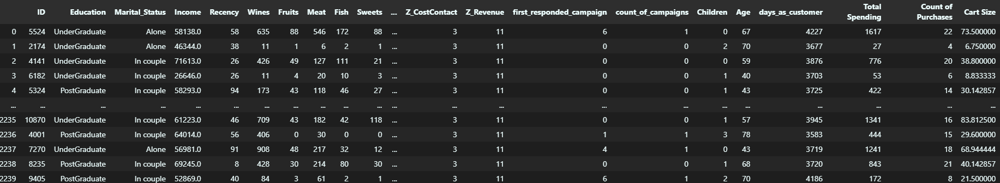
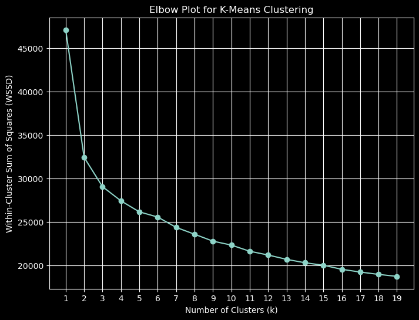
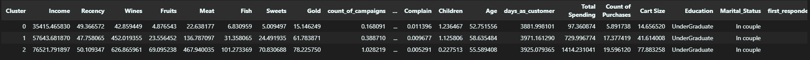
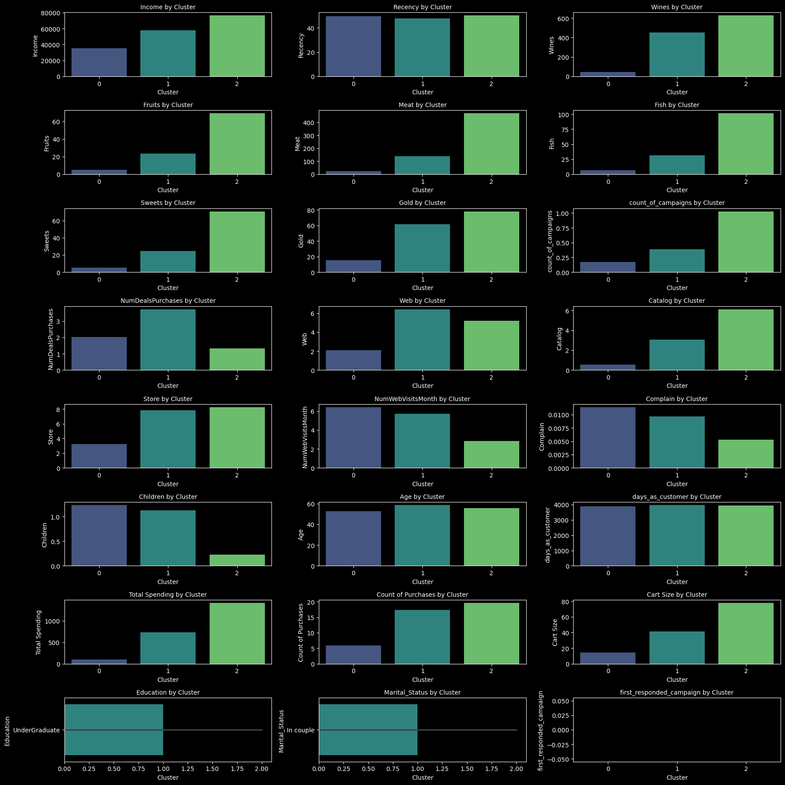

# DSI Cohort 6 Team Project - Customer Purchasing Behaviours

## Project Intro / Objective

The purpose of this project is to create customer personas by identifying groups of customers with similar demographic and purchasing behaviour. We aim to leverage clustering and exploratory data analysis to better understand customer segments, uncover patterns in behaviour, and generate insights that can inform marketing decisions.

In modern marketing and customer relationship management, understanding purchasing behaviour is critical for driving business success. Companies across sectors — including retail, e-commerce, financial services, and telecommunications — use customer segmentation to tailor campaigns, personalize offers, and optimize product development.

This project mirrors real-world data science applications in:  
    - Customer segmentation for targeted marketing strategies  
    - Churn prediction and retention planning  
    - Product recommendation systems  
    - Personalized communications and campaign optimization  

By identifying actionable customer personas, businesses can better allocate marketing budgets, increase customer lifetime value (CLV), and improve overall customer experience. Our approach aligns with industry practices such as Customer Persona marketing and clustering models frequently used in CRM and BI platforms.

##  Members

- Adriana Meraz
- Carolina Crespo
- Mubashara Malbari
- Ryan O'Grady
- Scott Lewis
- Surbhi Maheshwari
- Ts'ui Toy

## Project Question

- Can we use existing customer data to identify distinct customer clusters based on their purchasing behavior and demographic characteristics?

## Project Description

We are working with a structured dataset of customer transactions and demographics. Our goal is to:

- Understand the key features driving purchasing behaviours
- Create customer segments using clustering techniques
- Explore how demographics correlate with spending habits
- Present actionable personas and recommendations based on these insights

The Stakeholders for this project are:  
    - Marketing teams - use the personas to create tailored communications and strategies  
    - Business strategists - use the analysis to understand the different ways customers shop and how they might improve sales and engagement  

## Dataset Overview

- Source: Kaggle ([link](https://www.kaggle.com/datasets/imakash3011/customer-personality-analysis?resource=download))
- Records: ~2,200 customers. Data is anonymized by removing names and contact information.
- Features: 29 variables including demographics, spending habits, and campaign response

## Key Features:

- Demographics: Age, Education, Marital_Status, Income, Children, etc.
- Purchases: Amount spent on products such as wine, fruits, meat, fish, etc.
- Engagement: Number of store visits, campaign responses, online purchases, date of enrollment, recency, complaints

There was a mix of numerical and categorical variables. Some of the numerical were boolean. 

## A Note on Accessibility:
- We have implemented some features to make this project more accessible. 
    - Visualizations are in dark mode, as a team member requires this for accessibility purposes. 
        - plt.style.use('dark_background') can be removed from the code to switch the visuals to light mode.
    - Alt Text has been provided for visualizations in this document.
    - Veridis was chosen as the colour palette of our visualizations whenever possible.

## Methods Used:
- Data Cleaning and Pre-Analysis
    - We performed several steps to clean and prepare the data:
        - Checked for null values and duplicates
        - Combined campaign columns into first_responded_campaign and count_of campaign
        - Converted categorical features into numeric representations (using cat.codes method)
        - Created new features like Total Spending, Count of Purchases, Cart Size and days_as_customer
        - Dropped unnecessary columns
        - Scaled data using StandardScaler()

- Exploratory Data Analysis 
    - Our EDA focused on understanding the distribution of our variables in order to:
        - Get an overview of the data
        - Identify outliers
    - We used boxplots to visualize all numeric columns. This allowed us to see the distribution and identify which values we needed to consider adjusting.

- Imputation and Outliers
    - Based on our exploratory data analysis, we identified significant outliers in:
        - Income
        - Age
    - We used imputation, with the mean, to:
        - Replace outliers
        - Impute missing data
- Clustering (K-Means)
    - We applied K-Means Clustering after standardizing and transforming the features. The optimal number of clusters was determined using the elbow method.

    - Data was then clustered into 3 clusters.
    - We combined the scaled and clustered data with the processed data pre-scaling to get actual values of the variables again.
    - We then grouped the dataset by cluster and calculated mean or mode of the cluster.

  

- Data Visualization For Persona Storytelling
    - The barplots below serve to show the characteristics of each cluster in the different categories. Each of the plots contributed to our picture of who these donors might be.
    - We identified 3 distinct customer personas based on clustering analysis:
        - 1. Budget-Conscious Families (Cluster 0)

            - Low income (~ $35K) and low spending (~ $97)
            - Average age (~53), in a couple with ~1.2 children
            - Low purchase volume across all categories
            - Prefer in-store shopping, with low campaign engagement

        - 2. Mid-Income Traditional Shoppers (Cluster 1)

            - Moderate income (~ $57K) and mid-level spending (~ $730)
            - Older demographic (~59), mostly married
            - High purchases in wine and meat, moderate catalog/web use
            - Balanced cart size and channel usage

        - 3. Affluent Gourmet Enthusiasts (Cluster 2)

            - High income (~ $76K) and highest spending (~ $1,414)
            - Slightly younger (~56), but few or no children
            - Very high online engagement and luxury product interest (wine, meat, gold)
            - Highest cart size and purchase frequency

## Business Recommendations

Based on the insights from each persona, we recommend:

- Targeted Campaigns: Tailor discounts and offers by segment (e.g., luxury bundle for High-Income Gourmet)
- Channel Strategy: Market to segments based on their preferred channel (e.g., "Budget Friendly" marketing in store, "Luxury" marketing in catalog)
- Product Development: Stock preferences based on cluster-specific demand (e.g., fish and fruit for older segments)
## Technologies Used

- Python
- Jupyter Notebooks
- Kagglehub
- Pandas, NumPy, scikit-learn, matplotlib, seaborn

## Reproducibility

The reproducible part of this project is the entire Jupyter Notebook. 

## Folder Structure

DSI-Team-Project/
│
├── dataset/
│   └── marketing_campaign.csv
│
├── Visualizations/
│   └── visuals.png
│
├── DS5_Team_Project.ipynb/
│   
│
├── README.md

## Personal Reflections
- Ryan O'Grady: https://youtu.be/FM4YiiQNds4  
- Ts'ui Toy:  https://youtu.be/ni6rqU1TKsM  
- Carolina Crespo:  
- Adriana Meraz:  
- Scott Lewis:  
- Surbhi Maheshwari:  
- Mubashara Malbari:

## References

- Kaggle Dataset: Customer Personality Analysis
- "Data Science for Business" by Provost & Fawcett
- scikit-learn documentation
- seaborn documentation

